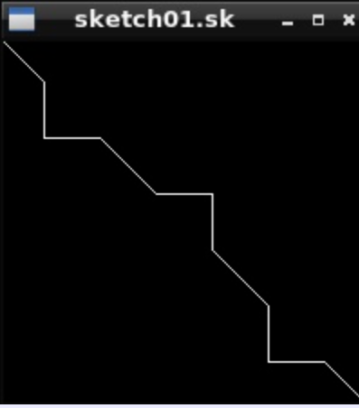
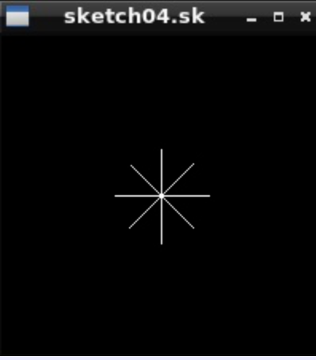

# Sketch Viewer

## Overview
A sketch file viewer implemented in C that reads and renders .sk sketch files in a 200x200 pixel window. This project demonstrates core skills in C programming, memory management, file I/O, and bit manipulation.

 
## Features
- Implements a drawing state to track current and target positions for the drawing tools.
- Reads .sk files in binary format and renders sketches in a GUI window.
- Proper memory allocation and deallocation for safe and efficient execution.

## Technical Highlights
- Bitwise operations: Extract opcodes and operands from command bytes, including signed two’s complement handling for 6-bit operands.
- Command execution: Updates drawing state and renders lines based on input commands.
- File processing: Reads binary sketch files byte by byte and processes all commands reliably.
- State management: Resets drawing state after rendering to support multiple sketches.

## Skills Demonstrated
- C programming (structs, pointers, memory management)
- File I/O (binary reading)
- Bit manipulation and two’s complement arithmetic
- Modular software design (separating state, display, and command logic)

  
